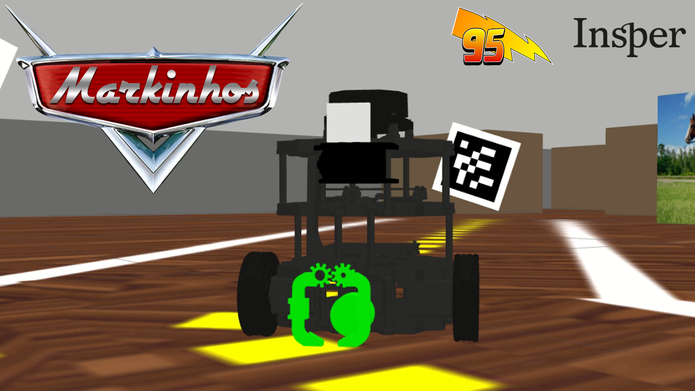
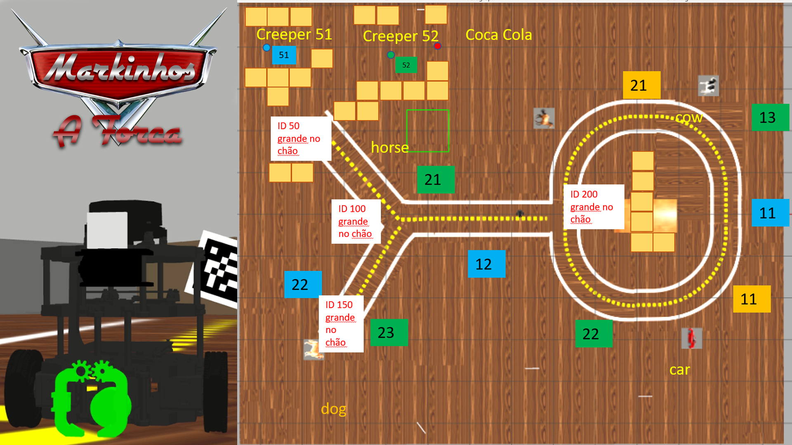
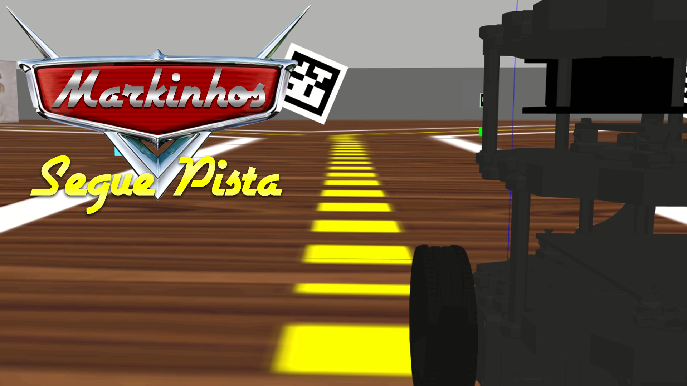
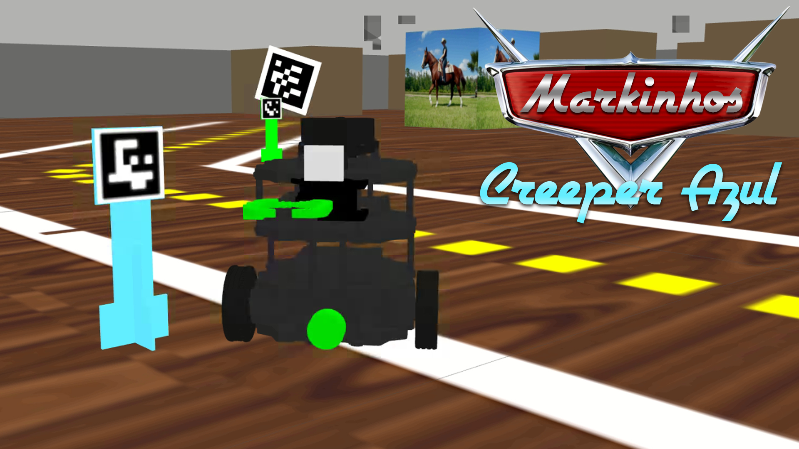
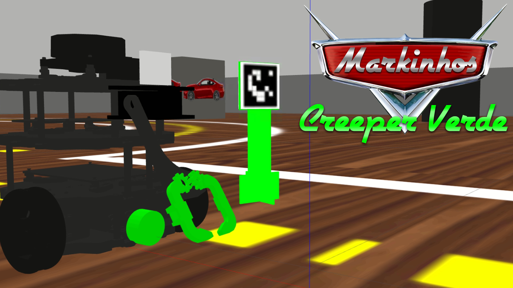
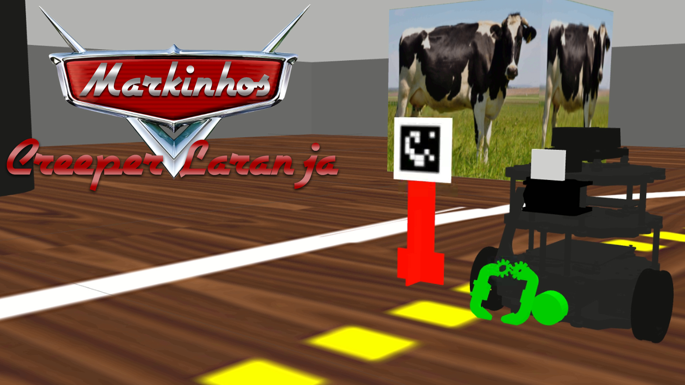

<div align="center">
<h1>
  <strong>Relâmpago Markinhos - Caçador de Creeper</strong>
</h1>

<p>
  
</p>

[](https://www.ros.org/)
[](http://gazebosim.org/)
[](https://www.python.org/)

# Mecânicos Responsáveis

<table>
  <tr>
    <td align="center"><a href="https://github.com/DaviReisVieira"><br /><sub><b>Davi Reis Vieira</b></sub></a><br /><a href="https://github.com/DaviReisVieira" title="Davi Reis Vieira">O Criativo</a></td>
    <td align="center"><a href="https://github.com/fran-janela"><br /><sub><b>Francisco Pinheiro Janela</b></sub></a><br /><a href="https://github.com/fran-janela" title="Francisco Pinheiro Janela">O Mestre de ROS</a></td>
    <td align="center"><a href="https://github.com/NicolasQueiroga"><br /><sub><b>Nicolas Maciel Queiroga</b></sub></a><br /><a href="https://github.com/NicolasQueiroga" title="Nicolas Maciel Queiroga">O Calculista</a></td>
  </tr>
</table>

# Objetivos

<p>
Relâmpago Markinhos é VELOCIDADE! Vencedor da Copa Pistão, Markinhos busca agora ajudar os Creepers perdidos no Circuito Forca. Para isso, ele conta com sua equipe técnica para guiá-lo neste desafiante circuito em busca dos objetivos. Confira abaixo, os objetivos de Markinhos!
</p>

<div>
<h2>Objetivo 1: Seguir a Pista</h2>
<p>
    
    
</p>
<p>Neste Objetivo, com a ajuda de seu amigo Mate e seu mentor, Doc Hudson, Relâmpago Markinhos tem o difícil desafio de reconhecer todo o circuito. Para isso, ele contou com diversos sensores e muita tecnologia de visão computacional. Podemos ver as gravações dele no link: </p>
<a href="https://youtu.be/XZNd8geoBpo" title="Seguidor de Pista">Relâmpago Markinhos - Reconhecimento de toda a pista (Conceito C)</a>
</div>

<div>

<h2>Objetivo 2: Salvar os Creepers e deixá-los em estações de segurança</h2>
<p>
Este objetivo é crucial para Relâmpago Markinhos: Salvar os Creepers perdidos no Circuito Forca! Ele recebe a missão de sua equipe por rádio e saber qual a cor do Creeper, seu ID e a estação mais segura para ele. Após localizá-lo, Markinhos o agarra com seu ferramental, retorna a pista e busca a estação-objetivo.
</p>

<h3>Objetivo 2.1: Missão 1 ("blue", 12, "dog")</h3>
<p>
    
</p>
<a href="https://youtu.be/qkSmkyzKwv0" title="Missão 1">Relâmpago Markinhos - Missão 1 (Conceito A)</a>

<h3>Objetivo 2.2: Missão 2 ("green", 23, "horse")</h3>
<p>
    
</p>
<a href="https://youtu.be/KQTrSiS9FLw" title="Missão 2">Relâmpago Markinhos - Missão 2 (Conceito A)</a>

<h3>Objetivo 2.3: Missão 3 ("orange", 11, "cow")</h3>
<p>
    
</p>
<a href="https://youtu.be/7692QlSTNNI" title="Missão 3">Relâmpago Markinhos - Missão 3 (Conceito A)</a>

</div>

# Você no Comando

<p>
Relâmpago Markinhos e sua equipe decidiram proporcionar uma experiência única! Agora você poderá escolher ou criar novas missões para ele! Além disso, poderá fazer o reconhecimento junto com Markinhos apenas selecionando o que deseja no início das Operações, ao Iniciar o 'Centro de Operações'!
</p>

```bash
    # Iniciar o Circuito Forca
    $ roslaunch my_simulation nova_forca.launch

    # Inicia a Garra e o Ombro
    $ roslaunch mybot_description mybot_control2.launch

    # Inicia o Centro de Operações do Relâmpago Markinhos
    $ rosrun ros_projeto projeto.py
```

<p>
Caso você queira alterar prints iniciais e seguir a pista pela esquerda, poderá acessar o config.py. O resto das configurações pelos inputs iniciais!  
</p>
</div>
